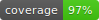

# [Eshop](http://194.5.192.129:4200/home) [](https://travis-ci.com/phessabi/eshop) 


Online shopping [website](http://194.5.192.129:4200/home).


---
## Installation
1. Install [Docker](https://phoenixnap.com/kb/how-to-install-docker-on-ubuntu-18-04) 

2. Install docker-compose:
    ```
    sudo apt install docker-compose
    ```
3. Get the Project:
    ```
    git clone "https://github.com/phessabi/eshop"
    ``` 
4. Go to the Root Directory:
    ```
    cd eshop
    ```    
5. Build Docker Image: 
    * If you can access docker in your country (if you can open this [link](https://hub.docker.com/)):
        ```
        sudo -E docker-compose up --build test
        ```

    * If docker is blocked in your country you have 2 options (second one is easier):
        * Use a vpn or any [method](https://shecan.ir) to bypass sanctions and do the previous step.

        * Download the [python docker image](https://www.dropbox.com/s/tqp8i7r77jloywe/python3.zip?dl=0) as "python3.zip" and run:
            ```
            sudo docker load -i python3.zip
            sudo -E docker-compose up --build test
            ```

## Run
+ Run the backend on docker (runs on localhost:8000):
    ```
    sudo docker-compose up
    ```

## Deployment

+ The application backend is currently running [here](http://194.5.192.129:8000/admin/)
+ Web page is currently running [here](http://194.5.192.129:4200/home)