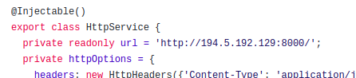

# [Eshop](http://194.5.192.129:4200/home) [](https://travis-ci.com/phessabi/eshop) 


Online shopping website: http://194.5.192.129:4200/home


## Table of Contents
1. **[Installation](#installation)**
    + [Backend](#backend)
    + [Frontend](#frontend)
1. **[Production](#production)**
1. **[Usage](#usage)**
1. **[Contributing](#contributing)**
    + [End Users](#end-users)
    + [Developers](#developers)
1. **[Credits](#credits)**


## Installation
1. Install [Docker](https://phoenixnap.com/kb/how-to-install-docker-on-ubuntu-18-04) 

1. Install docker-compose
    ```
    sudo apt install docker-compose
    ```
1. Install [Angular Build Requirements](https://linuxize.com/post/how-to-install-node-js-on-ubuntu-18.04/)  (node and npm)
   
+ ### Backend
    1. Get the backend
        ```
        git clone "https://github.com/phessabi/eshop"
        ``` 
    1. Go to the backend directory
        ```
        cd eshop
        ```    
    1. Build Docker Image: 
        * If you can access docker in your country (if you can open this [link](https://hub.docker.com/)):
            ```
            sudo docker-compose up --build test
            ```
    
        * If docker is blocked in your country you have 2 options (second one is easier)
            * Use a vpn or any [method](https://shecan.ir) to bypass sanctions and do the previous step
    
            * Download the [python docker image](https://www.dropbox.com/s/tqp8i7r77jloywe/python3.zip?dl=0) as "python3.zip" and run
                ```
                sudo docker load -i python3.zip
                sudo -E docker-compose up --build test
                ```
    1. Run the backend on container (runs on localhost:8000)
        ```
        sudo docker-compose up
        ```

+ ### Frontend
     1. Get the frontend
        ```
        git clone "https://github.com/pedramabdzadeh/agile-front-end"
        ``` 
    1. Go to the frontend directory
        ```
        cd agile-front-end
        ```
    1. Change the backend url to your localhost (http://0.0.0.0:8000/) in the file below
        ```
        agile-front-end/src/app/features/api-management/services/http/http.service.ts
        ```
        
    1. Build the angular image
        ```
        npm install -save
        ng build --prod --build-optimizer=false
        ```
    1. Serve the image(./dist/front-end/*) on [Apache](https://ubuntu.com/tutorials/install-and-configure-apache#1-overview) server (port :4200)
        ```
        sudo mkdir /var/www/agile.com
        sudo cp -r ./dist/front-end/* /var/www/agile.com/
        ```
    1. In your browser enter the URL: localhost:4200 to check if the app is working


## Production

+ The application is currently running [here](http://194.5.192.129:4200/home)

## Usage

+ Checkout [Wiki](https://github.com/phessabi/eshop/wiki)
 
## Contributing
+ ##### End Users
    + Send us your recommendations and bug reports in the [issues section](https://github.com/phessabi/eshop/issues)

+ ##### Developers
    + You can send pull requests to this repository. We will check them ASAP.
    
    more details and guidelines on **[contributing section](CONTRIBUTING.md)**
    
## Credits
+ Special Thanks to:
    + **[Milad CheraghaliKhani]()** as Owner
    + **[Ruhollah Sekaleshfar](www.github.com/RuhollahSeka)** as Backend Developer
    + **[Hossein Keshavarz](www.github.com/hossein-kshvrz)** as Backend Developer
    + **[Pedram Abdzadeh](www.github.com/pedramabdzadeh)** as Frontend Developer
    + **[Parham Hessabi](www.github.com/phessabi)** as Devops & Config Manager